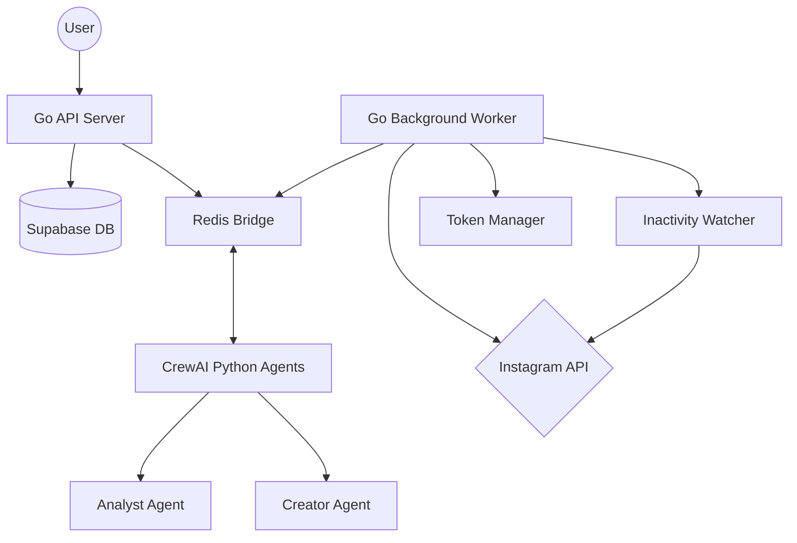

# 🤖 AI-ODA (Autonomous Social Media Agent)


**AI-ODA** is a state-of-the-art autonomous social media management system. It combines the performance of **Go**, the multi-agent orchestration of **CrewAI**, and real-time **Instagram** integration to automate content strategy, generation, and publishing.

---

## 🚀 Key Features

- **🧠 Multi-Agent Orchestration**: Specialized Python agents (Analyst, Creator, Critic) working together via CrewAI.
- **♻️ Content Recycling**: Automated analysis of high-performing legacy content for intelligent reuse.
- **🛡️ Safe-Gate Publishing**: Autonomous posting with double-validation (AI confidence scoring + negative keyword filtering).
- **🔐 Secure OAuth & Auth**: Integrated with Supabase Auth and Instagram Business API OAuth flow.
- **🔄 Auto Token Refresh**: Proactive management of Instagram long-lived tokens (72h prior to expiry).
- **📊 Insights Sync**: Daily synchronization of reach, impressions, and engagement metrics.
- **📡 Redis Bridge**: Seamless, high-performance communication between the Go worker and Python agents.

---

## 🏗️ Architecture



---

## 🛠️ Project Structure

- **`cmd/api`**: RESTful API for user management, OAuth integration, and task tracking.
- **`cmd/worker`**: The brain of the system—manages background tasks, insights sync, and agent communication.
- **`internal/`**: Core business logic:
  - `bridge/`: Redis bridge for Go-Python interop.
  - `social/`: Instagram API and OAuth clients.
  - `ai/`: Generic AI generation interface (OpenAI/Gemini).
  - `watcher/`: Autonomous trigger mechanism for content recycling.
- **`crewai/`**: Python source code for agents and specialized content tasks.
- **`migrations/`**: Supabase/Postgres SQL migration files.

---

## 🚦 Getting Started

### Prerequisites

- **Go** 1.23+
- **Python** 3.10+
- **Redis** server
- **Supabase** project (Auth & Database)
- **Meta/Instagram** Developer App

### Installation

1. **Clone and Setup Env**:
   ```bash
   cp .env.example .env
   # Fill in your keys (Supabase, Instagram, OpenAI/Gemini, Redis)
   ```

2. **Go Dependencies**:
   ```bash
   go mod download
   ```

3. **Database Setup**:
   - Create a new project in **Supabase**.
   - Apply the migrations found in the `migrations/` folder using the Supabase SQL Editor (start with `01_init_schema.sql`).
   - Enable **Auth** for user management.

4. **Python Dependencies**:
   ```bash
   make crewai-install
   ```

### Running the System

You need three services running for the full autonomous loop:

```bash
# Terminal 1: API Server
make dev

# Terminal 2: Worker Service
make worker

# Terminal 3: CrewAI Bridge
make crewai
```

---

## 📖 API Documentation

The API comes with built-in Swagger documentation. Once the API is running, visit:
🔗 [http://localhost:8080/swagger/index.html](http://localhost:8080/swagger/index.html)

---

## 🛠️ Developer Commands

| Command | Description |
| :--- | :--- |
| `make dev` | Start API server |
| `make worker` | Start background worker |
| `make crewai` | Start Python agent bridge |
| `make swagger` | Regenerate Swagger docs |
| `make build` | Build production binaries |
| `make test` | Run all unit tests |

---

## 🧪 Testing

The project uses Go's built-in testing framework. To run all tests across the internal packages:

```bash
make test
```

Currently, tests cover:
- **Auth Middleware**: JWT validation and context handling.
- **Supabase Client**: Database interactions and integration checks.

---

## 🛡️ License

This project is licensed under the MIT License. See the [LICENSE](LICENSE) file for details.
